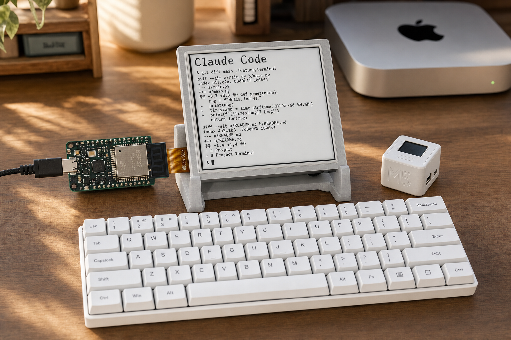

# eink-claude-terminal — 전자잉크 Claude Code 단말

> 보유 e-ink 기기 + 블루투스 키보드로, 맥미니(24시간 서버)의 Claude Code를 쓰는 실물 단말을 만든다.



## 현재 상태

- **✅ Phase 1 완료 + Phase 2-① 한글 표시 완료 (2026-07-31)**: X4에서 Claude Code 실시간 미러(**한글 지원**, 100×26셀) + 타이핑 동작. 토큰 인증 + OTA 무선업데이트 적용 (상세: [docs/daily/2026-07-31.md](docs/daily/2026-07-31.md))
- **⚡ 반응속도 개선 (2026-07-31 오전)**: 체감 1.5~2s → **0.6~1.0s**. WiFi 절전 해제(RTT 0.7s→25ms) + 화면갱신 FreeRTOS 태스크 분리 + /bandraw 스트리밍(전체 프레임 430ms) + 브리지 mDNS 1회 해석 + 폴링 0.12s. 남은 한계는 e-ink partial 물리속도(~0.4s)
- **🔋 배터리 잔량 바 (2026-07-31 오후)**: 화면 최상단 2px 바로 잔량 표시 (전폭=100%, `/status` battery 재사용, 5% 단위 갱신)
- **사용법**: `scripts/start_mirror.sh` 실행 → 아무 터미널에서 `tmux attach -t x4-terminal`로 타이핑
- **다음**: Phase 2 계속 — BLE 키보드 직결 입력, Cloudflare Tunnel 외부 사용

## 핵심 결론 (Phase 0)

1. **VS Code GUI를 e-ink에 띄우는 건 불가** — Claude Code는 터미널 프로그램이므로 "터미널 미러/단말"이 정답.
2. **1호기 = Xteink X4** (4.3" 480×800, ESP32-C3, 부분갱신, WiFi+BLE). 이미 SUMI 한글 펌웨어 개조 + 정품 백업 + 플래시 절차 확보 상태.
3. **기성 오픈소스 존재**: [xteink-terminal](https://github.com/maddiedreese/xteink-terminal) — X4를 tmux 미러로 만드는 펌웨어+Python 브리지. 우리 시나리오와 정확히 일치.
4. **X4에서 BLE 키보드 실타이핑 이미 성공** (2026-06-25~26, xteink-ebook 트랙에서 HID 파싱 버그 수정 후 한글 조합까지 작동) — 키보드 블로커는 사실상 해소.
5. 외부(인터넷만 되는 곳) 사용은 **Cloudflare Tunnel** 재활용(cardputer-relay의 buddy.prefloor.io 패턴)으로 해결.

## 로드맵 (요약 — 상세는 [docs/ROADMAP.md](docs/ROADMAP.md))

| 단계 | 내용 | 비용/기간 | 상태 |
|---|---|---|---|
| **1** | X4 + xteink-terminal 미러 (키보드는 맥미니 페어링, 집 전용) | 0원 / 반나절 | ✅ 2026-07-31 |
| **2** | 브리지에 입력(`tmux send-keys`) + Cloudflare Tunnel → 외부 사용 | 0원 / 1~2주 | ☐ |
| **3** | (선택) X4 네이티브 터미널 앱 — CrossPoint 생태계 오픈소스 기여 | 수 주 | ☐ |
| 보험 | Pi Zero 2 W + Waveshare 4.2" + PaperTTY (~5만원) — 1·2단계 불만족 시 | 보류 | ☐ |

## 폴더 구조

```
README.md                  ← 이 파일. 상태·로드맵 요약 (매일 갱신)
docs/
  ROADMAP.md               ← 단계별 상세 + 결정 기록(D1~) + 스코프
  hardware.md              ← 투입 기기 스펙·제약
  research/2026-07-28-research.md ← Phase 0 통합 리서치 (레포·사례 전체)
  daily/YYYY-MM-DD.md      ← 작업일지 (매일 1장)
assets/concept.png         ← 상상도
```

## 운영 규칙

- **매일 업데이트**: 작업한 날은 `docs/daily/날짜.md` 1장 추가 + README 상태·체크박스 갱신.
- **결정은 ROADMAP.md의 D번호로 기록** (이유 + 비용 + 탈출구).
- 세션에서 이어서 작업할 때: "eink 터미널 이어가자" → README → ROADMAP → 최신 daily 순으로 읽기.

## 관련 자산 (다른 폴더)

- `~/xteink-ebook` — X4 플래시 절차, 정품 백업(`backups/`), SUMI 한글 펌웨어, BLE 키보드 성공 로그(`backups/keylog.txt`)
- `~/gooddisplay-nametag` — 4.2" 패널(GDEY042T81, 부분갱신 0.39초) + ESP32 데모보드 (2호기 후보)
- `~/cardputer-relay` — Cloudflare Tunnel + 기기 비밀키 인증 Flask 패턴 (2단계에서 재활용)
- `~/cardputer-claude-os` — Claude Code BLE MCP 연동 선례
